## 0x00 Interesting Fashion Vector Database Usage 

1. [[voyager.pdf|Voyager]]:Use LLM in Minecraft that continuously explores the world

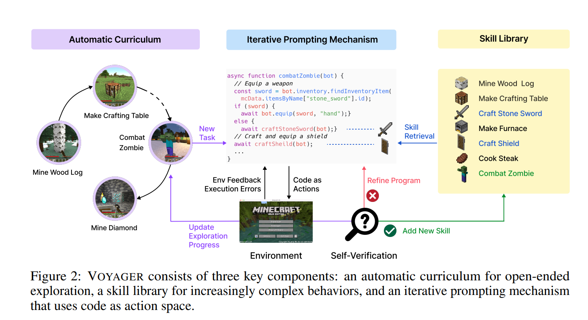
---
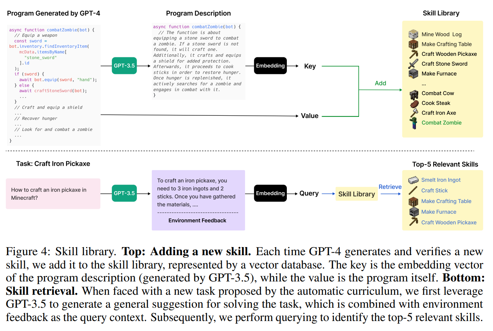

---

1.   
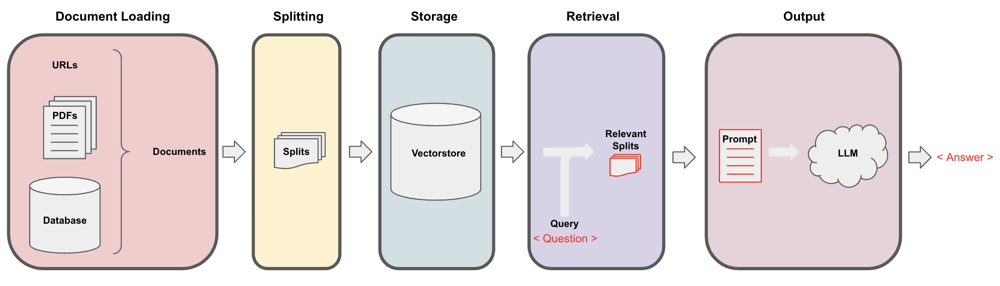
---
e.g. https://github.com/akshata29/chatpdf

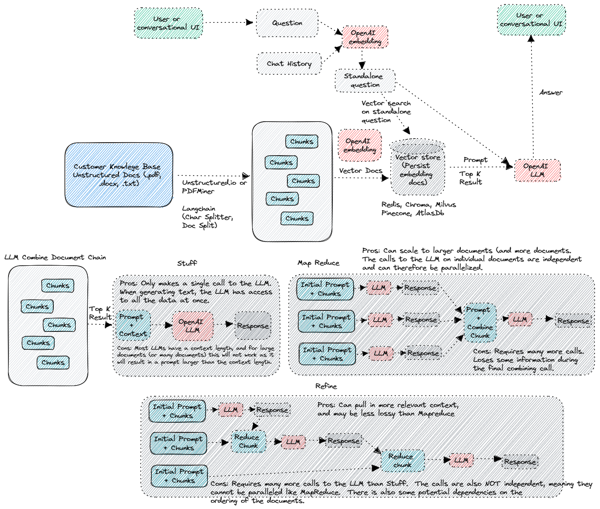

3. Use Cases
	1. Agents/Agent Simulation
	2. Chat Bots
	3. Code Understanding
	4. QA over Documents
	5. Summarization
	6. Analyzing Structured Data
---

## 0x01: Different Databases' Vector Index

1. Postgresql: 
2. Apache Lucene(Mongo?/ElasticSearch)
3. Milvus: https://github.com/milvus-io/milvus
4. DiskANN: https://github.com/microsoft/DiskANN
5. SPANN: https://github.com/microsoft/SPTAG
---

## 1. Postgresql Index Structure 

Every table/index of PG is stored as an array of pages with a fixed size

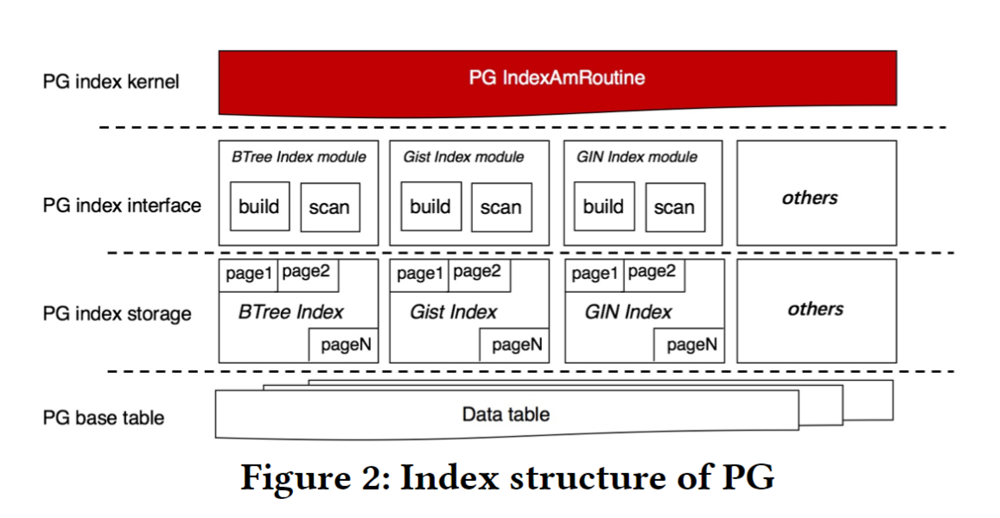

---

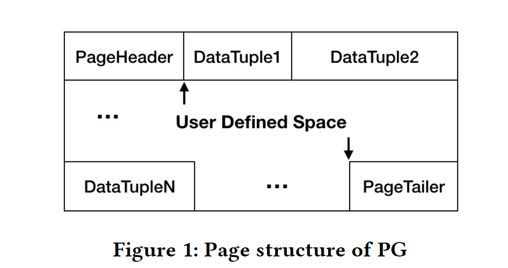

---

### 1.1 PASE: IVF_FLAT

- A centroid page is employed to store cluster information.
- A data page is similar to an inverted chain in a search engine that stores all vectors belonging to a certain cluster.

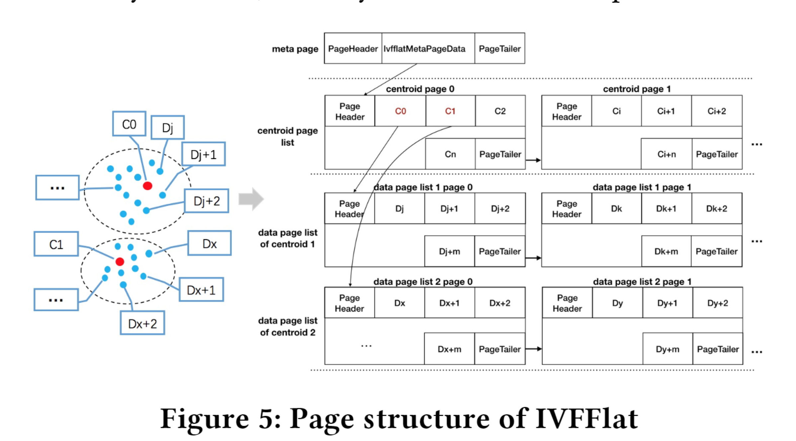

---

### 1.2 PASE:HNSW

- A data page is used to store raw vector data.
- A neighbor page is employed to store edges between  
adjacent nodes.

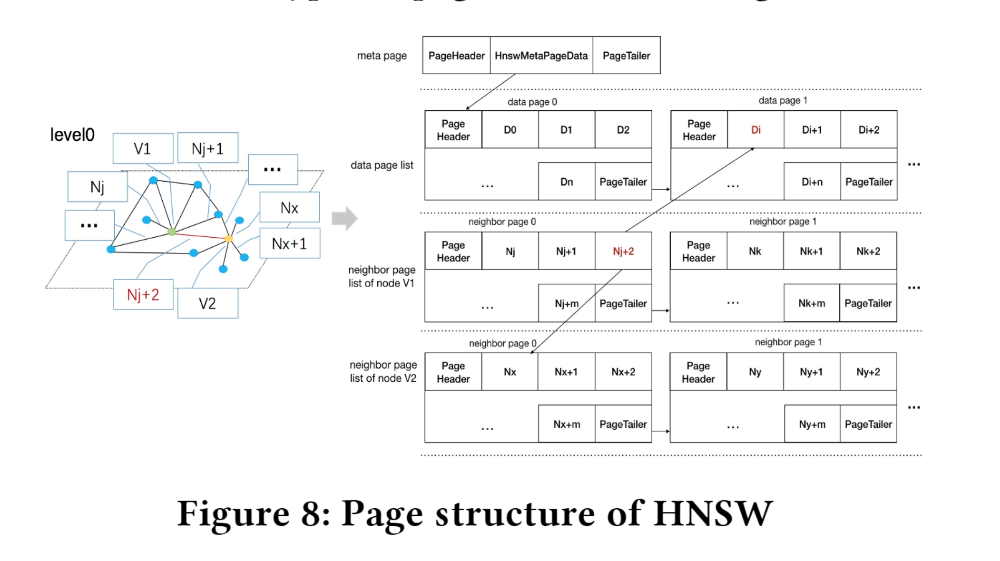

---

## 2. Apache Lucene

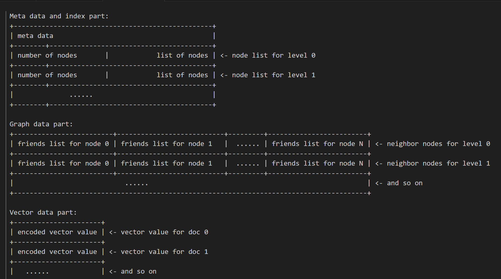

Read OffHeapHNSWGraph( by .e.g mmap) from File and search on it

## Index Files

Lucene 9.5 vector format, which encodes numeric vector values and an optional associated graph connecting the documents having values. The graph is used to power HNSW search. The format consists of three files:

### .vec (vector data) file
For each field:
- Vector data ordered by field, document ordinal, and vector dimension. When the vectorEncoding is BYTE, each sample is stored as a single byte. When it is FLOAT32, each sample is stored as an IEEE float in little-endian byte order.
- DocIds encoded by IndexedDISI.writeBitSet(DocIdSetIterator, IndexOutput, byte), note that only in sparse case
- OrdToDoc was encoded by org.apache.lucene.util.packed.DirectMonotonicWriter, note that only in sparse case
### .vex (vector index)
Stores graphs connecting the documents for each field organized as a list of nodes' neighbours as following:
- For each level:
	- For each node:
		- \[vint\] the number of neighbor nodes
		- array\[vint\] the delta encoded neighbor ordinals
- After all levels are encoded memory offsets for each node's neighbor nodes encoded by org.apache.lucene.util.packed.DirectMonotonicWriter are appened to the end of the file.
### .vem (vector metadata) file
For each field:
- \[int32\] field number
- \[int32] vector similarity function ordinal
- \[vlong] offset to this field's vectors in the .vec file
- \[vlong] length of this field's vectors, in bytes
- \[vlong] offset to this field's index in the .vex file
- \[vlong] length of this field's index data, in bytes
- \[vint] dimension of this field's vectors
- \[int] the number of documents having values for this field
- \[int8] if equals to -1, dense – all documents have values for a field. If equals to 0, sparse – some documents missing values.
- DocIds were encoded by IndexedDISI.writeBitSet(DocIdSetIterator, IndexOutput, byte)
- OrdToDoc was encoded by org.apache.lucene.util.packed.DirectMonotonicWriter, note that only in sparse case
- \[vint] the maximum number of connections (neigbours) that each node can have
- \[vint] number of levels in the graph
- Graph nodes by level. For each level
	- \[vint] the number of nodes on this level
	- array\[vint] for levels greater than 0 list of nodes on this level, stored as the level 0th delta encoded nodes' ordinals.

## Add Doc

1. add vector field and build in-memory graph
2. flush to file when commit
3. merge graph when merge segment ^9a98a9
---

## 3. Milvus

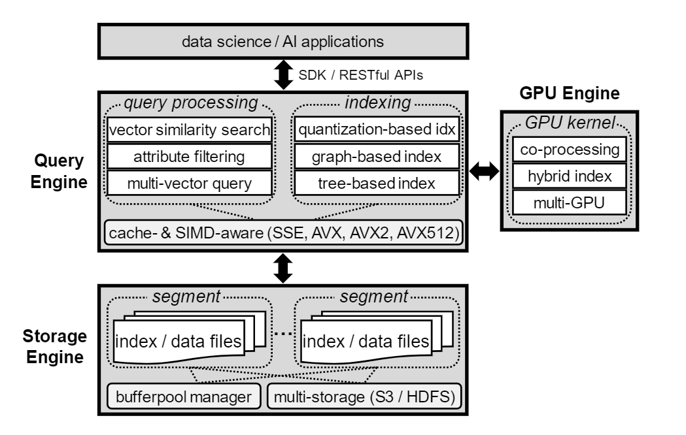

- Each segment has multiple versions and a new
version is generated whenever the data or index in that segment is changed (e.g., upon flushing, merging, or building index)

> Milvus supports efficient insertions and deletions by adopting theidea of LSM-tree [47]. Newly inserted entities are stored in memoryfirst as MemTable. Once the accumulated size reaches a threshold,or once every second, the MemTable becomes immutable and thengets flushed to disk as a new segment==

---

## 4. DiskANN

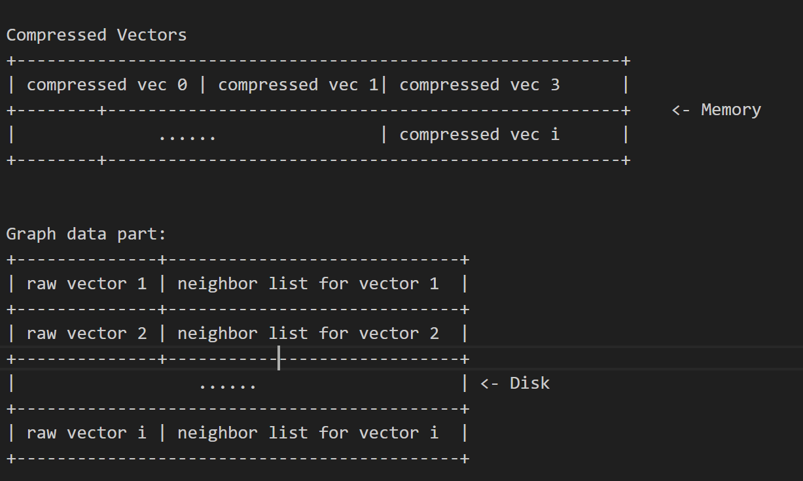

DiskANN Contains 2 part
- Vamana Index Algorithm
- Disk Index Layout

## 5. SPANN/SPTAG

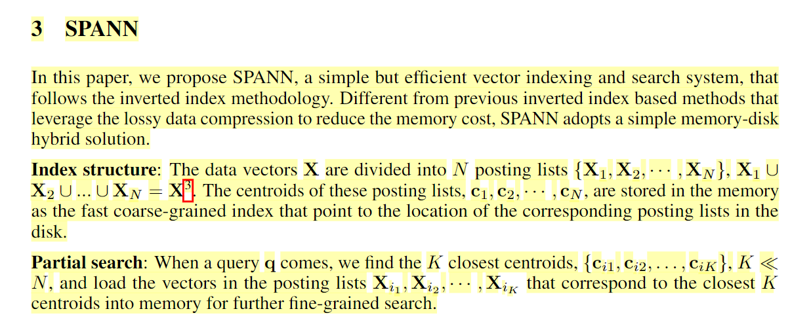

SPANN/SPTAG focus on the in-memory index building, for searching in very large dataset.
SPTAG constructs space partition trees and a relative neighborhood graph as the vector index which can speedup the nearest centroids search to sub-millisecond response time

---

## 0x02: possible design in kv-store

1. Store IVF/Neighbor Graph index in Rocksdb
2. Implement Rocksdb Memtable using a vector index format?

For 1:

1. Random Access a position in file(lucene/DiskANN/SPANN)
2. Access blocks from one to another(pg)

**Use Prefix for item aggregation**

---

### 1. One possible design of IVF
Suppose we have a vector encoding method

**Use multiple pair to store an IVF list of a centroid vector** 

|key|value|
|----|----|
|t\_centroid\_\[1.0,1.5\]\_0|\[\[1.0,1.1],\[1.0,1.2]...]|
|t\_centroid\_\[1.0,1.5\]\_1|\[\[1.1,1.1],\[1.1,1.2]...]|
|t\_centroid\_\[1.0,1.5\]\_2|\[\[1.2,1.1],\[1.2,1.2]...]|
|t\_centroid\_\[1.0,2.5\]\_0|\[\[1.0,2.1],\[1.0,2.2]...]|
|t\_centroid\_\[1.0,2.5\]\_1|\[\[1.1,2.1],\[1.1,2.2]...]|

---

or

|key|value|
|----|----|
|t\_centroid\_\[1.0,1.5\]\_0|\[1.0,1.1]|
|t\_centroid\_\[1.0,1.5\]\_1|\[1.0,1.2]|
|t\_centroid\_\[1.0,1.5\]\_2|\[1.1,1.1]|
|t\_centroid\_\[1.0,1.5\]\_3|\[1.1,1.2]|
|t\_centroid\_\[1.0,1.5\]\_4|\[1.2,1.1]|
|t\_centroid\_\[1.0,1.5\]\_5|\[1.2,1.2]|
|t\_centroid\_\[1.0,2.5\]\_0|\[1.0,2.1]|
|t\_centroid\_\[1.0,2.5\]\_1|\[1.0,2.2]|
|t\_centroid\_\[1.0,2.5\]\_2|\[1.1,2.1]|
|t\_centroid\_\[1.0,2.5\]\_3|\[1.1,2.2]|

---

### 2. One possible design of HNSW

Use KV to represent graph

|key|value(distance, neighbor vec)|
|----|----|
|t\_vec\_lv0\_\[1.0,1.5\]|\[\(0.1, \[1.0,1.1]),\(0.2,\[1.0,1.2])...]|
|t\_vec\_lv0\_\[1.1,3.5\]|\[\(0.1, \[1.0,1.1]),\(0.2,\[1.0,1.2])...]|
|...|...|
|t\_vec\_lv1_\[1.2,4.5\]|\[\(0.1, \[1.0,1.1]),\(0.2,\[1.0,1.2])...]|

or expand to multiple lines like IVF

---

For 2: ?

1. 索引重建
2. SST 合并、SST Builder
3. merge operator
4. 向量索引的内存部分不是memtable 而是SST Meta 信息 super index
5. memtable可以就是部分数据，比如构建一个小的索引
6. PlainTable

## 0x03 

