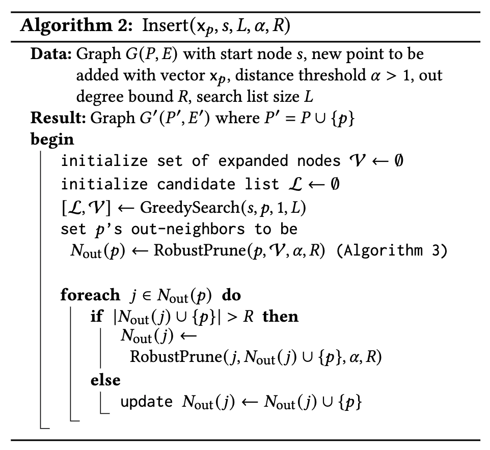
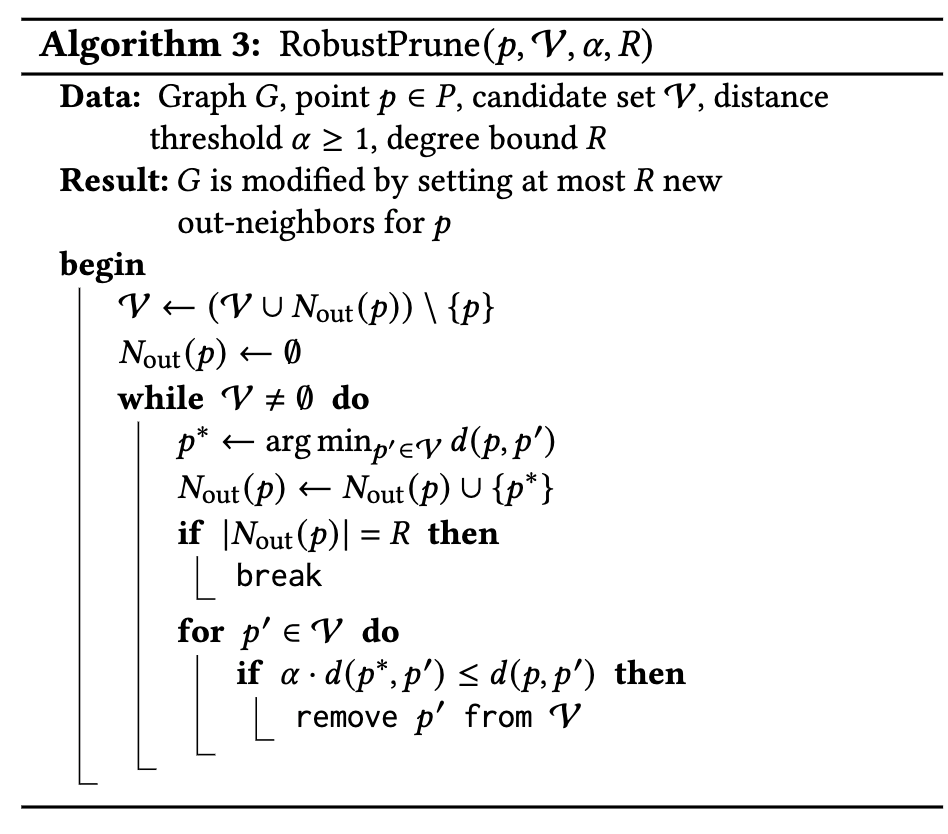
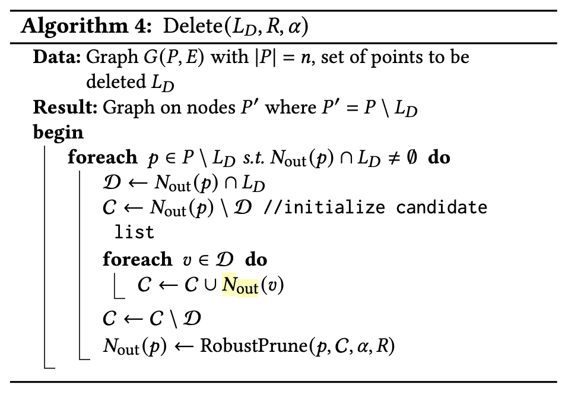

[PDF](https://arxiv.org/pdf/2105.09613.pdf)

FreshDiskANN分为几部分
1. FreshVamana构图算法
2. 索引文件结构和内存数据结构
   1. Temporary Index(TempIndex)
   2. RO- and RW-TempIndex
   3. Long-Term Index (LTI) 数据结构基本和 [diskann](/posts/existing-vectordb/#4-diskann) 一致
3. 一种StreamingMerge模式
   1. Delete Phase(block by block process delete list point)
   2. Insert Phase(do graph insert block by block, but defer backward edge to Patch Phase)
   3. Patch Phase(patch backward edge)
4. Crash Recovery, 写入时写redo-log

