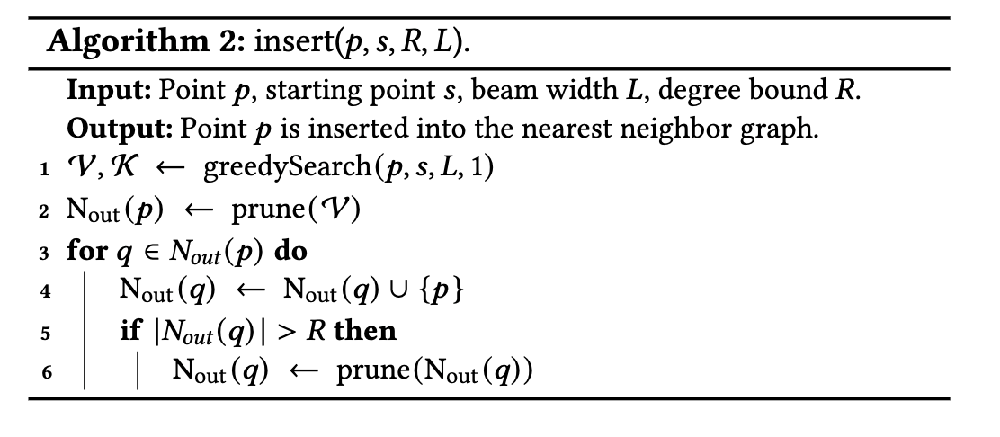
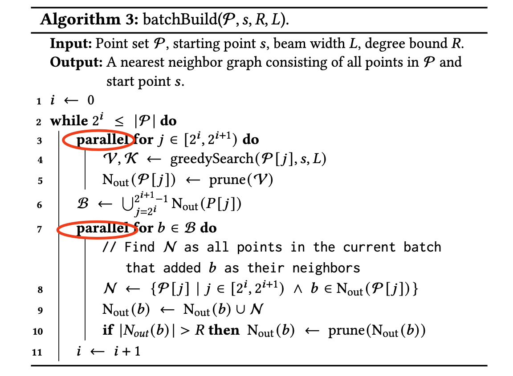

[Scaling Graph-Based ANNS Algorithms to Billion-Size Datasets: A Comparative Analsyis](https://arxiv.org/pdf/2305.04359.pdf)

[ParlayANN](https://github.com/cmuparlay/ParlayANN)

> 1. In this paper, we propose a set of principled measures for evaluating ANNS algorithms which refocuses on their scalability to
billion-size datasets. These measures include ability to be efficiently
parallelized, build times, and scaling relationships as dataset size increases. 
> 2. We also expand on the QPS measure with machine-agnostic
measures such as the number of distance computations per query,
and we evaluate ANNS data structures on their accuracy in more
demanding settings required in modern applications, such as eval-
uating range queries and running on out-of-distribution data. 
> 3.  We
optimize four graph-based algorithms for the billion-scale setting,
and in the process provide a general framework for making many
incremental ANNS graph algorithms lock-free. 

