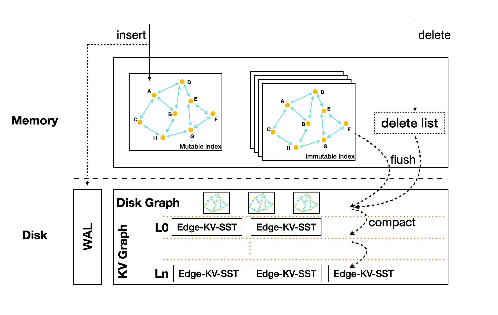
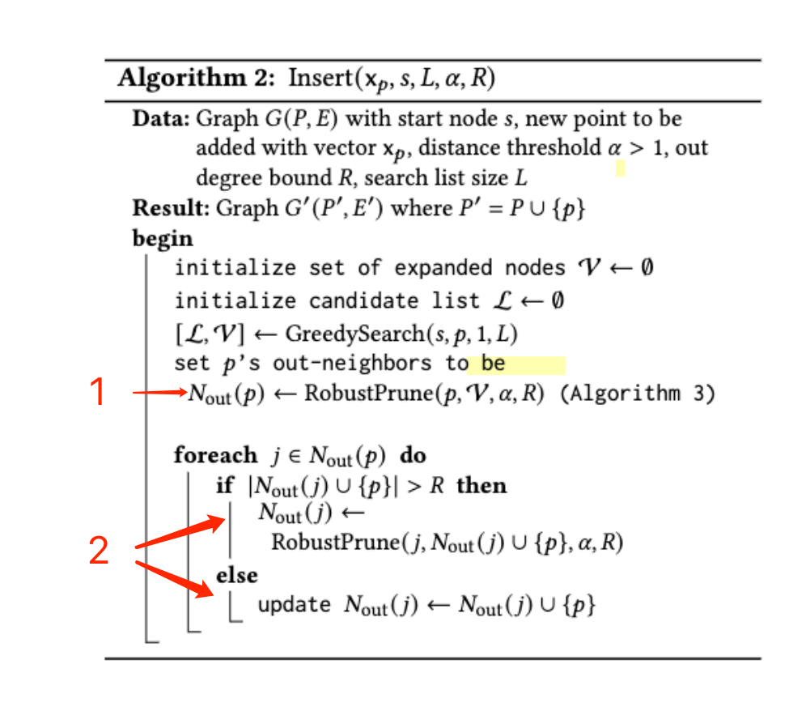
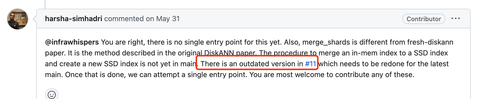

## 1. disk graph 如何和 kv graph 合并

FreshDiskANN的写入过程中，会对图的结构做以下变更
1. 新写入的点创建它的出边
2. Nout(p)的出边会被prune
3. Delete流程会更新Nout(d)的上游和下游

对于这些变更的点（以及Nout(p)），我们需要一直缓存在内存中，直到这个disk graph写入kv graph完成

会有这样几个问题：
1. 缓存的点是否会很多？预估是变更点的常数倍数，也许需要实验
2. 如果每个disk graph有自己的cache，是否意味着这个步骤不能并发？

## 2. disk graph如何查询
花费k倍的内存，缓存disk graph，mmap到内存中执行图查询?

## 3. 是否存在一种图分割&合并的方式（暂时不考虑）

 DISKANN是进行了kmeans之后，对于每个点都加入2-closest cluster中，合并时简单地连接所有的边。但是这个步骤仅限全量构造图的流程中。

如果我们能找到一种streaming的聚类方式，也许可以对图进行这样的分割。

## 4. DiskANN代码

FreshDiskANN 实现在一个很老的(2021.6)的，实验性的分支上，虽然能build(有些依赖比如MKL库要改)，但是是否能用于我们的baseline？

https://github.com/microsoft/DiskANN/issues/405#issuecomment-1656370311
https://github.com/microsoft/DiskANN/issues/355#issuecomment-1568944560
https://github.com/microsoft/DiskANN/pull/11

## 5. plan

1. 在RockDB上设计vector insert&search的框架
	1. 确定要改的代码范围
		1. memtable结构变化
		2. 增加一层disk graph
		3. disk graph merge into kv graph
		4. in-memory的额外结构，topK queue、deletelist等
	2. 先实现成robust knn？
2. 实现FreshDiskANN的Vamana索引
	1. 使用diskann repo的代码？如上所述是一个outdated状态

