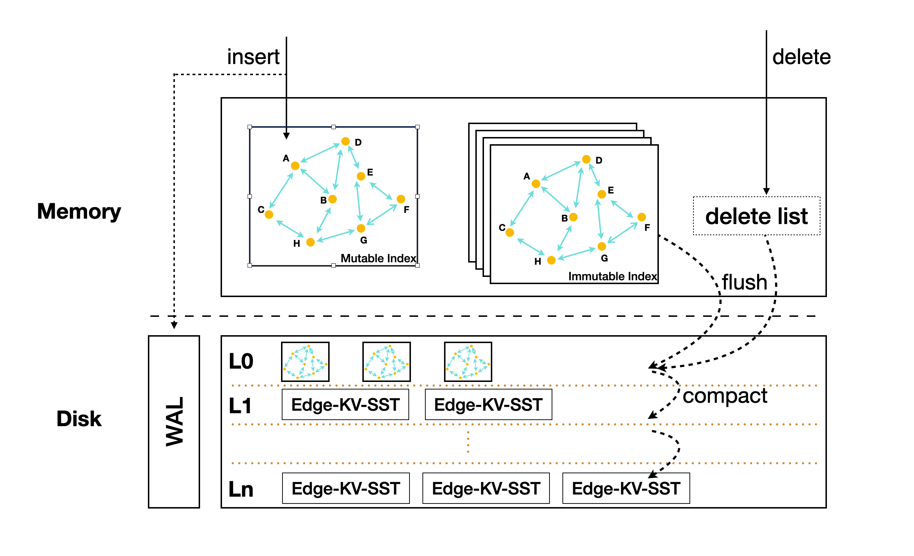

## 1. Overview



## 1.1 Algorithm

Use same FreshVamana algorithm from [FreshDiskANN](/posts/fresh-diskann/)


## 2. Operations

### 2.1 Insert & Delete Procedure

1. insert into mutable FreshVamana index memtable
2. convert to immutable when reach the threshold.
3. flush to L0 file, which is same structure as immutable index.
4. StreamingMerge L0 file, delete list to Ln(n >= 1) file.

### 2.2 Search

0. consturct a KNN search queue
1. search from memtable
2. load l0 to disk and search
3. search from all sst file using graph based search


## 3. Data Structure

### 3.1 In Memory 
raw data:

```
|id|vector|
|id|vector|
|id|vector|
...
|id|vector|
...
```

index:
graph relation which can be `std::vector<std::vector<uint32_t>> _final_graph;`

#### 3.1.1 raw data & index

#### 3.1.2 DeleteListFilter

### 3.2 On Disk

index:

```
|src1_dst1|is_valid/id info|
|src1_dst2|is_valid/id info|
|src1_dst3|is_valid/id info|
...
|src2_dst1|is_valid/id info|
...
```


raw data:

```
|id|vector|
|id|vector|
|id|vector|
...
|id|vector|
...
```

